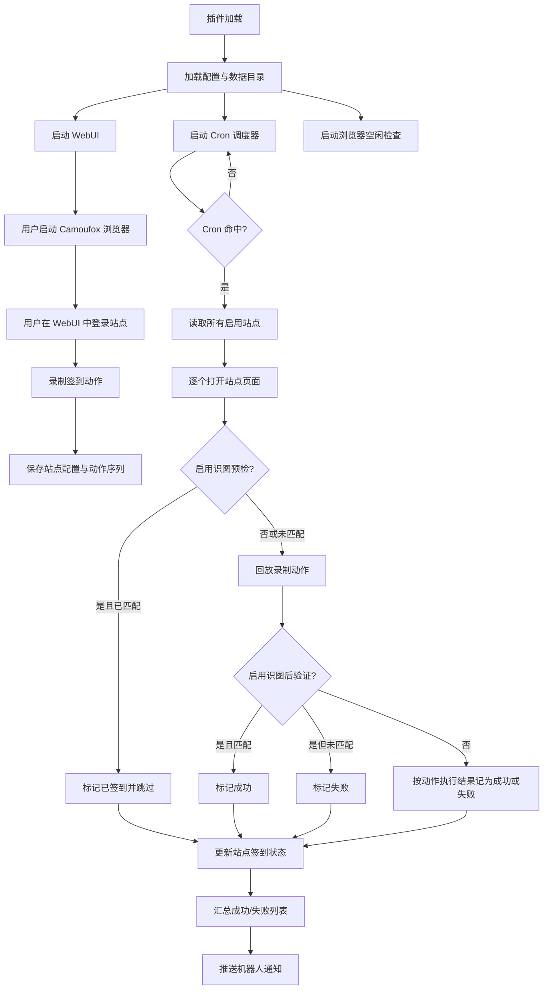

# mai_autocheckin

MaiBot 自动签到插件 —— 通过 Camoufox 浏览器自动化实现多网站每日定时签到。

> 本插件由 [astrbot_plugin_autocheckin](https://github.com/StarDevProcess/astrbot_plugin_autocheckin) 迁移而来。

## 功能

- **WebUI 可视化面板**：内置 VNC 式浏览器控制面板，在网页上直接操作浏览器
- **操作录制与回放**：录制签到所需的点击/输入/拖动/滚动操作，保存后自动回放
- **可视化操作编辑**：逐步查看和编辑录制好的操作，支持修改参数、调整顺序、删除和手动添加步骤
- **定时签到**：支持 Cron 表达式灵活定时，可配置多条计划规则自动执行签到
- **多站点管理**：支持同时管理多个站点，独立启用/禁用
- **识图验证**：宿主配置 `vlm`（视觉）任务时自动启用，通过截图识别判断签到是否成功
- **签到预检**：签到前自动识别是否已签到，避免重复操作
- **消息通知**：签到完成后通过机器人会话推送结果
- **登录持久化**：基于持久化浏览器 Profile，重启后无需重新登录
- **空闲自动关闭**：浏览器空闲超时后自动关闭，节省资源
- **WebUI 登录鉴权**：token 登录 + IP 绑定 + 可配置会话超时，防止面板裸露访问
- **依赖自动安装**：首次启动自动安装 Python 依赖、Linux 系统库并下载 Camoufox 浏览器二进制

## 插件逻辑

### 核心链路

1. 插件加载后初始化配置、数据目录、WebUI 服务、Cron 调度器和浏览器空闲检查任务。
2. 用户先在 WebUI 中启动 Camoufox 浏览器，通过 VNC 画面手动登录目标站点。
3. 用户为每个站点录制签到动作，动作会以浏览器原生坐标系保存到本地数据文件。
4. 到达定时规则后，调度器遍历所有启用站点，逐个打开页面并回放录制动作。
5. 如果启用了识图验证，系统会先做签到前预检，避免重复签到；签到后再做一次二次验证。
6. 启用识图验证时，签到后二次验证结果会覆盖原始签到结果；匹配关键词记为成功，未匹配记为失败。
7. 执行结果会更新到站点状态中，并通过机器人消息推送到已绑定会话。

### 流程图



## 安装

1. 将本仓库克隆到 MaiBot 的插件目录：

```bash
cd <MaiBot目录>/plugins/
git clone https://github.com/blissky/mai_autocheckin.git
```

2. 重启 MaiBot 或在 WebUI 插件管理中加载本插件。

3. 首次加载时插件会自动安装 `requirements.txt` 中的 Python 依赖，并下载 Camoufox 浏览器二进制文件。如果自动安装失败，请在 MaiBot 运行环境中手动执行：

```bash
pip install "camoufox[geoip]>=0.4.0" "aiohttp>=3.9.0"
python -m camoufox fetch
```

Linux 服务器还需要 Camoufox 运行所需的系统库（插件会尝试自动安装；Debian/Ubuntu 手动安装示例）：

```bash
apt-get install libgtk-3-0 libx11-xcb1 libasound2 libxtst6
```

## 使用方法

### WebUI 操作

1. 插件加载后，访问 `http://127.0.0.1:9010` 打开控制面板（默认仅监听本机；如需远程访问，请将 `[webui] host` 配置改为 `0.0.0.0`）
2. 先输入 WebUI 登录密钥（`[webui] token`）完成登录验证
3. 点击「启动浏览器」启动 Camoufox 浏览器；也可以直接在地址栏或站点列表点击「前往」，若浏览器尚未启动会自动启动并导航
4. 在 VNC 画面中操作浏览器，登录目标网站
5. 在左侧面板添加站点
6. 点击「开始录制」，在浏览器中执行签到操作，然后「停止录制」
7. 在「操作编辑」区域检查录制结果，可逐步编辑每个操作的参数、调整步骤顺序或手动增删步骤
8. 将录制的操作保存到对应站点
9. 登录后若切换访问 IP，或超过 `[webui] session_timeout` 配置的时间未进行操作，需要重新输入登录密钥
10. 签到流程会在每天设定的时间自动执行

### 操作编辑

在「录制操作」选项卡下方的操作编辑区域，支持：

- **编辑**: 点击铅笔图标修改操作参数
- **排序**: 使用上下箭头调整步骤执行顺序
- **删除**: 移除不需要的步骤
- **添加**: 点击底部「+ 添加操作步骤」手动插入新步骤
- **加载**: 选择站点后点击「加载操作」可将已保存的操作加载到编辑器中进行修改

### 机器人指令

| 指令 | 说明 |
|------|------|
| `/签到 执行` | 立即执行全部站点签到 |
| `/签到 单签 <站点名>` | 签到指定站点 |
| `/签到 状态` | 查看所有站点签到状态 |
| `/签到 绑定` | 绑定当前会话接收签到结果通知 |
| `/签到 解绑` | 解除签到通知绑定 |
| `/签到 面板` | 获取 WebUI 控制面板地址 |

> 通知绑定基于 MaiBot 的 stream_id 持久化保存。如果宿主升级或数据迁移后通知失效，请在目标会话中重新发送 `/签到 绑定`。

## 配置项

配置文件为插件目录下的 `config.toml`，也可在 MaiBot WebUI 的插件配置页中修改，保存后自动生效（插件会重启 WebUI 与定时任务）。

> `[plugin]` 节仅含宿主要求的 `config_version` 版本号字段（宿主校验 config.toml 时的硬性要求），勿手动修改。

### `[webui]`

| 配置 | 类型 | 默认值 | 说明 |
|------|------|--------|------|
| `port` | int | 9010 | WebUI 控制面板端口 |
| `host` | string | `127.0.0.1` | WebUI 监听地址，默认仅本机可访问；需要远程访问时改为 `0.0.0.0` |
| `token` | string | `sk-change-me` | WebUI 登录密钥，访问控制面板时需要输入 |
| `session_timeout` | int | 30 | WebUI 登录超时（分钟），超时未操作需重新登录 |
| `trust_proxy` | bool | false | 仅部署在可信反向代理后时开启，使用 `X-Forwarded-For` 识别客户端 IP |
| `screenshot_interval` | int | 500 | VNC 画面刷新间隔（毫秒） |

### `[schedule]`

| 配置 | 类型 | 默认值 | 说明 |
|------|------|--------|------|
| `cron_rules` | string | `30 8 * * *` | 定时签到计划，Cron 表达式，每行一条 |
| `timezone` | string | `Asia/Shanghai` | 定时签到所使用的时区 |

### `[browser]`

| 配置 | 类型 | 默认值 | 说明 |
|------|------|--------|------|
| `headless` | bool | true | 是否以无头模式运行浏览器 |
| `page_load_timeout` | int | 30 | 页面加载超时（秒） |
| `action_delay` | int | 1000 | 回放操作间隔（毫秒） |
| `checkin_wait` | int | 5 | 站点页面导航完成后、执行签到前识图预检与动作回放前的等待时间（秒） |
| `idle_timeout` | int | 10 | 浏览器空闲自动关闭（分钟，0=不关闭） |

> 识图验证没有独立配置项：插件启动时会自动检测宿主 MaiBot 是否配置了 `vlm`（视觉）任务，已配置则启用识图验证，详见下方「识图验证」一节。

### Cron 表达式

格式为标准 5 字段 Cron：`分 时 日 月 周`

```
 ┌─── 分钟 (0-59)
 │ ┌─── 小时 (0-23)
 │ │ ┌─── 日 (1-31)
 │ │ │ ┌─── 月 (1-12)
 │ │ │ │ ┌─── 周几 (0-6, 0=周日)
 │ │ │ │ │
 * * * * *
```

支持语法：`*`（任意值）、`*/n`（步进）、`n-m`（范围）、`n,m`（列表）

示例（多条规则每行一条，TOML 中使用多行字符串）：

```toml
cron_rules = """
30 8 * * *
0 12 * * 1-5
0 20 1,15 * *
"""
```

| 表达式 | 含义 |
|--------|------|
| `30 8 * * *` | 每天 8:30 |
| `0 9 * * 1-5` | 工作日（周一至周五）9:00 |
| `0 8,20 * * *` | 每天 8:00 和 20:00 |
| `*/30 * * * *` | 每 30 分钟 |
| `0 10 1 * *` | 每月 1 日 10:00 |

## 识图验证

识图验证由宿主的模型配置自动决定：插件启动时检测 MaiBot 是否配置了 `vlm`（视觉）任务，已配置则自动启用，无需在插件侧配置。检测结果会输出在插件启动日志中。

启用后：

1. 在 WebUI 的「识图选区」选项卡中框选签到结果区域
2. 设置识图关键词（支持正则表达式），如 `签到成功|已签到`
3. 签到前会自动预检：如果关键词已匹配则跳过操作
4. 签到后二次验证：当启用识图验证时，后验证结果覆盖原始签到结果，匹配返回成功，未匹配返回失败
5. 通过 WebUI 执行签到时，识图截图会显示在操作日志中

识图通过 MaiBot 的 LLM 接口调用 `vlm` 任务的多模态模型，图像以 OpenAI 风格的 `image_url`（base64 data URL）消息体传入。请确保 `vlm` 任务配置的模型支持图像输入，可先在 WebUI「识图选区」页中用「识图测试」验证效果。

## 数据存储

插件数据存储在 MaiBot 分配的插件数据目录中：

- `sites.json` — 站点配置与录制的操作序列
- `notify_targets.json` — 消息通知绑定列表（stream_id）
- `browser_profile/` — 浏览器持久化 Profile（保持登录状态）

WebUI 登录会话仅保存在内存中，插件重启后需要重新登录。

兼容说明：如果检测到旧版 `forums.json`，插件会自动读取并迁移到 `sites.json`。

## 安全建议

- **及时修改默认登录密钥**：`token` 默认值为 `sk-change-me`，启用后请立即修改
- **录制内容明文存储**：录制时通过键盘输入的所有文本（包括登录密码）会明文保存到 `sites.json`，请妥善保管数据目录，尽量利用浏览器持久化登录态而非在录制动作中输入密码
- **公网部署**：如需公网访问 WebUI，建议通过 HTTPS 反向代理（如 Nginx）转发，并开启 `trust_proxy` 以正确识别客户端 IP；不要直接将明文 HTTP 端口暴露到公网
- **登录保护**：同一 IP 连续输错密钥 5 次后会被锁定，锁定时间按失败次数指数递增（最长 15 分钟）

## 依赖

- Python 3.10+
- [camoufox](https://github.com/daijro/camoufox) — 反指纹浏览器
- [aiohttp](https://github.com/aio-libs/aiohttp) — WebUI 服务器
- [playwright](https://github.com/microsoft/playwright-python) — 浏览器自动化（由 camoufox 内部使用）

## 实现说明

- WebUI 与录制、回放、识图选区全部统一使用浏览器原生坐标系 `1366x768`。
- 浏览器截图与识图裁剪统一使用 CSS 像素尺度，避免 DPI 与随机视口带来的偏移问题。
- 启用识图验证时，签到后验证结果覆盖原始签到结果：匹配返回成功，未匹配返回失败。
- 浏览器空闲自动关闭按真实浏览器操作重新计时，避免“全部签到”执行中途被误关。
- Web 端全部签到、命令签到和定时签到共用同一套签到结果判定逻辑与动作间隔配置。
- 批量签到按“启动浏览器 → 逐站点导航 → `checkin_wait` → 前识图预检 → 动作回放 → 后识图验证”执行；`checkin_wait` 从站点 `page.goto(..., wait_until="domcontentloaded")` 返回后开始计时。
- WebUI 通过 `token` 登录，并在切换访问 IP 或超过 `session_timeout` 未操作时要求重新登录。
- WebUI 地址栏与站点列表的「前往」在浏览器未启动时会自动启动浏览器再导航。
- MaiBot SDK 无内置定时器，插件使用自研 Cron 解析 + 30 秒轮询的 asyncio 任务实现调度。

## 常见问题

- **启动浏览器报 `No module named 'camoufox'`**：依赖自动安装失败，请在 MaiBot 运行环境中手动 `pip install "camoufox[geoip]"`。
- **报 Camoufox 二进制未下载**：手动执行 `python -m camoufox fetch`。
- **Linux 下浏览器启动失败**：多为缺少系统库，参考安装章节手动安装 GTK3 等依赖。
- **识图调用失败**：确认宿主 MaiBot 已配置 `vlm` 任务，且该任务的模型支持图像输入；多模态消息体格式依宿主实现可能存在差异，可用 WebUI「识图测试」定位问题。
- **收不到签到通知**：在目标会话中重新发送 `/签到 绑定`。

## TODO

- 在真实 MaiBot 宿主环境完成端到端冒烟测试（命令交互、多模态识图消息体格式、空闲超时长任务、WebUI 鉴权全路径、旧 `forums.json` 迁移链路）。

## 许可证

AGPL-3.0 license
